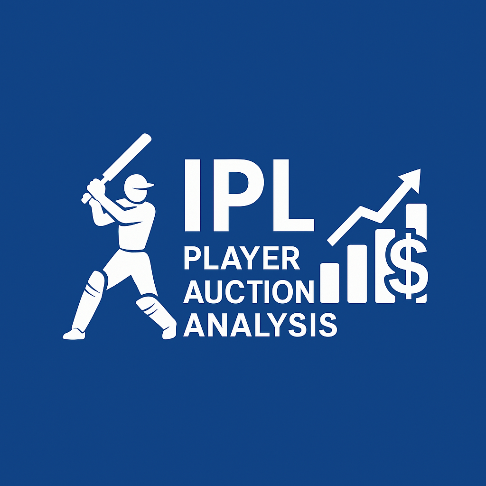

# 🏏 IPL Player Auction Analysis (2008–2020)

## 📌 Project Summary

This project investigates the relationship between the **auction prices of IPL players** and their **on-field performance** across multiple seasons (2008–2020). The central question is: _Do high-cost players consistently deliver better results, or do moderately priced players offer better value for money?_

Using Python-based data analysis tools, we merged auction data with ball-by-ball match performance to compute key metrics for batters and bowlers. Through exploratory data analysis (EDA), correlation studies, and ROI scoring, we uncovered insights that challenge conventional auction strategies and highlight the importance of data-driven decision-making in franchise planning.

---

## 🎯 Objectives

- Analyze the correlation between player auction price and performance metrics.
- Define and compute meaningful indicators like runs, strike rate, wickets, and economy rate.
- Identify undervalued players who offer high return on investment (ROI).
- Assist IPL franchises in making smarter, cost-effective auction decisions.

---

## 🛠️ Tools & Technologies

- **Python** (Jupyter Notebook via Anaconda Navigator)
- **Libraries:** Pandas, NumPy, Matplotlib, Seaborn
- **Data Sources:** Kaggle IPL Auction Dataset & IPL Matches Dataset & deliveris Dataset

---

## 📁 Algorithms and Techniques Used in Project 
 
- **Correlation Analysis** 
- Algorithm: Pearson Correlation Coefficient
- Purpose: Measures linear relationship between auction price and player performance (runs or wickets).
- Used in:
batting_df['Price'].corr(batting_df['Runs'])

- **Linear Regression (Visualization Only)**
- Algorithm: Simple Linear Regression (via sns.regplot)
- Purpose: Visualizes trend lines between price and performance.
- Used in:
sns.regplot(data=batting_df, x='Price', y='Runs')

- **Aggregation and Grouping**
- Algorithmic Concept: GroupBy + Aggregation
- Purpose: Summarizes data (e.g., total runs, wickets, sixes).
- Used in:
deliveries.groupby('batsman')['batsman_runs'].sum()

## 📊 Key Insights

- No strong correlation between auction price and performance metrics.
- Several mid-range players consistently outperform high-cost stars.
- ROI scoring reveals undervalued talent across seasons.
- Franchise-level analysis shows varying auction efficiency.

## 👥 Contributors
- Ankur Soni
- Ansh Nayak
- Chinmoy Jyoti Kashyap
- Kalyan Baishya
- Rohan Kuli
Submitted to: IDEAS – Institute of Data Engineering, Analytics and Science Foundation, ISI Kolkata

  

